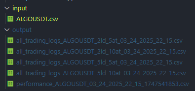
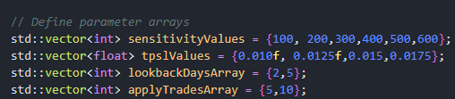
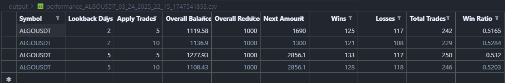
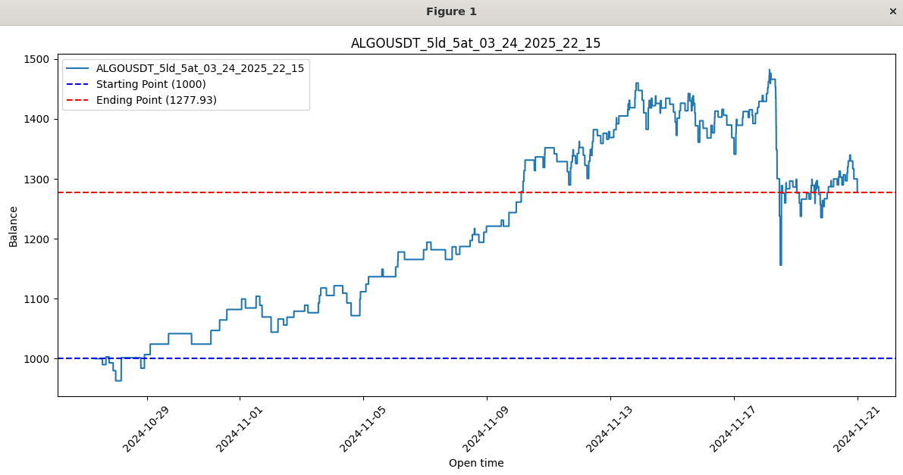

# Optimization Based Backtesting with Modern C++

Gathering data from Binance and backtesting trading strategies (Donchain Breakout 1 Minute Scalping) with C++.

## Getting Started

Only thing that needed is C++20 and Python installed on your machine.,

## Before Execute

Make sure that you have coin data as csv with following format

| Open time          |Open |High |Low  |Close|
|-|-|-|-|-|
| 2024-11-18 11:30:00 |4.348|4.502|3.342|3.941|
| 2024-11-18 11:31:00 |3.934|4.0  |3.82 |3.867|
| 2024-11-18 11:32:00 |3.866|3.871|3.757|3.807|

Then, modify example.cpp main function with giving the path of the csv data.

I already uploaded ALGO coin data ready for you to use. It's basically 1 month of data with 1 minute time frame.

### Executing the program

If everything is ready (If you have csv data under input), run the program with `./buildrun.sh`

### What to Expect

With rolling window optimization technique, a csv file as an output that includes coin candle data and balance will be placed at csv_output/ folder as follows:

In the example.cpp file, there are 2 different type of parametrs. Sensivity (Lookback) and TPSL are the dynamically chosen inside the optimization but lookback days and apply trades are kinda fixed.

Since we have 4 combinations of possible applying scenarios, we have 4 output csv. Performances result of them together are under `performance_COINNAME` csv file:

All csv files starting with all_trading_logs_xxx are for following the balance.

It can be visualized by visualize.py

## Authors

Luftmenschh\
[@Github](https://github.com/luftmensc)\
[@LinkedIn](https://www.linkedin.com/in/omer-faruk-okuyan/)
