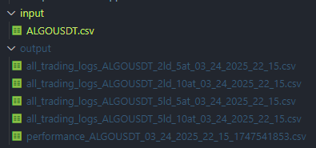
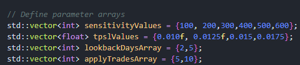
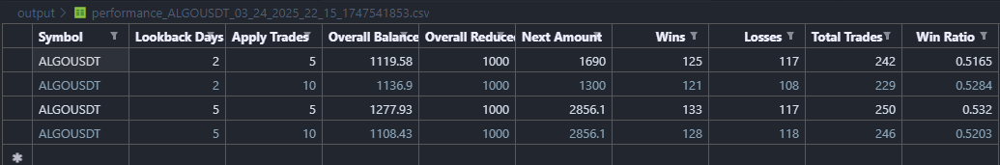
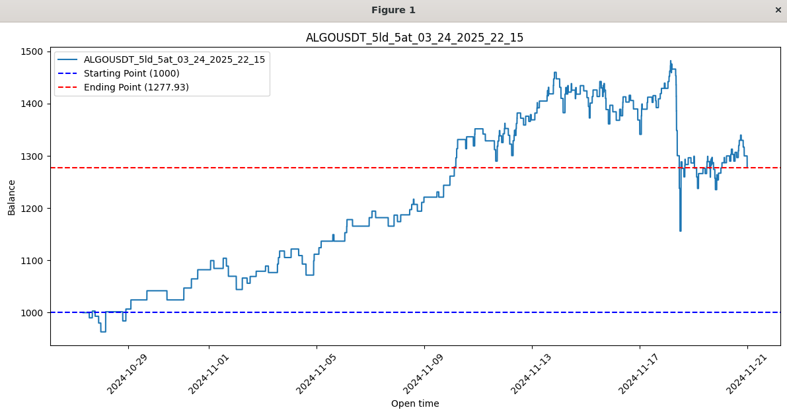

# Optimization Based Backtesting with Modern C++

Gathering data from Binance and backtesting trading strategies (Donchain Breakout 1 Minute Scalping) with C++.

## Getting Started

Only thing that needed is C++20 and Python installed on your machine.,

## Before Execute

Make sure that you have coin data as csv with following format


| Open time          |Open |High |Low  |Close|
|-|-|-|-|-|
| 2024-11-18 11:30:00 |4.348|4.502|3.342|3.941|
| 2024-11-18 11:31:00 |3.934|4.0  |3.82 |3.867|
| 2024-11-18 11:32:00 |3.866|3.871|3.757|3.807|

Then, modify example.cpp main function with giving the path of the csv data.

I already uploaded ALGO coin data ready for you to use. It's basically 1 month of data with 1 minute time frame.

### Executing the program

If everything is ready (If you have csv data under input), run the program with `./buildrun.sh`

### What to Expect

With rolling window optimization technique, a csv file as an output that includes coin candle data and balance will be placed at csv_output/ folder as follows:



In the example.cpp file, there are 2 different type of parametrs. Sensivity (Lookback) and TPSL are the dynamically chosen inside the optimization but lookback days and apply trades are kinda fixed.



Since we have 4 combinations of possible applying scenarios, we have 4 output csv. Performances result of them together are under `performance_COINNAME` csv file:




All csv files starting with all_trading_logs_xxx are for following the balance.

It can be visualized by visualize.py


## Backtest with Trading Costs

The `example` program above does not pay any fee. The `backtest` program runs the same idea (breakout of a
channel, rolling optimization of the parameters, applying them to the next trades) with the costs of
real trading:

- Taker and maker fees, slippage and the funding payments of Binance USDT-M futures
- The signal is known at the close of a bar, the order is filled on the open of the next 1 minute candle
- Stop and take profit are checked on the 1 minute candles, if both are inside of one candle the stop is used
- Position size from the risked amount (1% of the balance per trade by default), without martingale
- Report with Sharpe, Sortino, Calmar, max drawdown, profit factor, expectancy and more

### Getting the data

Requires only Python 3, no package and no API key is needed.

```
python3 scripts/binance_fetch.py                  # BTC, ETH, SOL, BNB - last 730 days, 1 minute candles
python3 scripts/binance_fetch.py --update         # Append the new candles later
```

### Running

```
./buildrun.sh                                     # Build and run the backtest with the default strategy
./buildrun.sh backtest --risk 0.02 --start 2026-04-01
./buildrun.sh example                             # The original program
build/bin/backtest --help                         # All the options
```

The default strategy uses 4 hour bars: enter when the close breaks the channel in the direction of the
200 bar ema, exit with a trailing stop of the ATR. Channel length and stop distance are chosen again on the
last 90 days after every 10 trades (or 30 days).

The results are written to `output/` as `<tag>_summary.json`, `<tag>_equity.csv`, `<tag>_trades.csv`,
`<tag>_stops.csv` (stop price of every trade) and `<tag>_windows.csv` (chosen parameters of every window). `visualize.py` also plots the equity files.

`scripts/research.py` runs many variants of the strategy and prints them as one table.

### Chart of the trades

```
python3 scripts/plot_trades.py                       # BTCUSDT of the last ./buildrun.sh run (tag breakout_4h)
python3 scripts/plot_trades.py --symbol ETHUSDT --timeframes 240,60,15,5
```

Creates `output/<tag>_<SYMBOL>_chart.html`, an interactive candlestick chart for the browser with the entry and
exit of every trade, the stop loss (with the moves of the trailing stop), the take profit and the channel
level which was broken. Click on a trade to see its details, the arrow keys go to the next trade.

### Results

2 years of 1 minute data (2024-09-27 - 2026-09-27), 10000 capital split equally between BTC, ETH, SOL and BNB.
The strategy was developed only with the data before 2026-04-01, the data after it was tested one time
at the end.

| | Original (1m) | Original without costs | Default strategy (4h) |
|-|-|-|-|
| Development period, return | -78.0% | 59.5% | 8.9% |
| Development period, Sharpe / Sortino | -3.58 / -4.53 | 1.26 / 2.07 | 1.05 / 1.92 |
| Test period (last 6 months), return | -31.2% | 11.7% | -0.3% |
| Test period, Sharpe / Sortino | -2.63 / -3.42 | 1.03 / 1.64 | -0.05 / -0.09 |
| Max drawdown (all data) | 83.5% | 20.2% | 7.2% |

The original strategy makes about 7700 trades and every trade costs about 0.14% (fees and slippage), which
is more than the profit of the signal. The default strategy is not proven to be profitable: it did not
make money on the test period. Do not trade it with real money without paper trading first.

## Paper Trading

`scripts/paper_trader.py` runs the default strategy on the live data of Binance with fake money. No order is
sent to the exchange and no API key is needed.

Every minute it downloads the new closed candles and runs the `backtest` program in the live mode from the
start of the paper trading until now. The positions, the stops and the balance are always calculated from
the data: a restart loses nothing and the decisions are the same as the decisions of a backtest.

```
python3 scripts/paper_trader.py init                 # Create paper/, download 180 days of history
python3 scripts/paper_trader.py run                  # Trade until it is stopped
python3 scripts/paper_trader.py status               # Balance, positions and the last events
python3 scripts/plot_trades.py --tag paper --input-dir paper/data --output-dir paper/output
```

`init` has the options `--capital`, `--symbols`, `--start` and `--option NAME=VALUE` for the options of the
`backtest` program (for example `--option risk=0.02`). Every entry, stop move and exit is written to
`paper/events.csv` and `paper/paper.log`.

The fills are simulated like in the backtest: market orders are filled on the open of the next 1 minute
candle with slippage, stops at the stop price with slippage. A new candle is seen some seconds after it
is closed, so an entry or exit is reported about 5 seconds later than it happens.

### Running on a server

```
sudo apt install build-essential cmake python3
git clone <this repository> && cd OptimizedTrader
cmake -S . -B build -DCMAKE_BUILD_TYPE=Release
cmake --build build --target backtest -- -j1
python3 scripts/paper_trader.py init
./deploy/install_service.sh                          # systemd service, starts again after a reboot
```

The service has the lowest priority and is limited to half of one CPU core and 600 MB of memory
(`deploy/paper-trader.service`). Binance does not answer requests from some countries (for example the USA),
test it on the server with `curl https://fapi.binance.com/fapi/v1/time`.

## Authors

Luftmenschh\
[@Github](https://github.com/luftmensc)\
[@LinkedIn](https://www.linkedin.com/in/omer-faruk-okuyan/)
